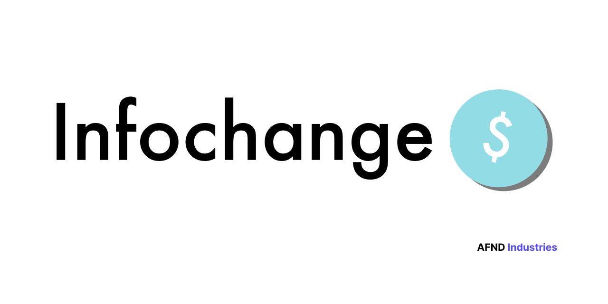

# InfoChange 🚀

> by AFND Industries 🏢

 

---

## Introducción 📚

**InfoChange** es una innovadora aplicación diseñada para facilitar la compra y venta de acciones y criptomonedas. Con una interfaz intuitiva y funciones avanzadas, nunca ha sido tan sencillo realizar operaciones en bolsa o en blockchain.

---

## Características Destacadas 🌟

- **Interfaz Intuitiva**: Diseñada para ofrecer la mejor experiencia de usuario.
- **Operaciones Seguras**: Implementamos las últimas tecnologías en seguridad para proteger tus inversiones.
- **Soporte de Criptomonedas**: Compra y vende una amplia variedad de criptomonedas.
- **Actualizaciones en Tiempo Real**: Información actualizada para tomar las mejores decisiones.

<!--  -->

---

## ¿Por Qué Elegir InfoChange? 🤔

1. **Fácil de Usar**: Nuestra aplicación está diseñada pensando en la simplicidad y eficiencia.
2. **Transacciones Rápidas**: Realiza transacciones en cuestión de segundos.
3. **Seguridad Garantizada**: Protégete con nuestras avanzadas medidas de seguridad.
4. **Soporte 24/7**: Siempre estamos aquí para ayudarte.

<!----> 

---

## Cómo Empezar 🛠️

1. **Accede la web**: Disponible en [InfoChange.me](https://infochange.me).
2. **Regístrate**: Crea una cuenta en pocos pasos.
3. **Explora**: Navega y descubre las múltiples opciones de inversión.
4. **Invierte**: Comienza a comprar y vender acciones y criptomonedas.


---

## Advertencia ⚠️

**InfoChange** es un simulador. No utilizamos datos personales o financieros en ningún momento. Todas las operaciones y datos presentados son ficticios y tienen fines exclusivamente educativos y de entretenimiento.

---

## Enlaces Útiles 🔗

- **Sitio Web**: [InfoChange.me](https://infochange.me)
- **Documentación**: [Documentación Oficial](https://server.infochange.me/terms)
- **Soporte**: [Centro de Ayuda](https://infochange.me/support)

---

## Instalación 🖥️

### Requisitos

Antes de comenzar, asegúrate de tener instalados los siguientes requisitos:

- Node.js (versión 12 o superior)
- npm (Node Package Manager) o yarn

### Pasos para la Instalación

1. **Clonar el Repositorio**:
    ```bash
    git clone https://github.com/tu_usuario/infochange.git
    ```

2. **Navegar al Directorio del Proyecto**:
    ```bash
    cd infochange
    ```

### Instalación del Frontend

1. **Navegar a la Carpeta del Cliente**:
    ```bash
    cd client
    ```

2. **Instalar las Dependencias**:
    - Usando **npm**:
      ```bash
      npm install
      ```
    - Usando **yarn**:
      ```bash
      yarn install
      ```

3. **Iniciar la Aplicación Vite del Cliente**:
    ```bash
    npm run dev
    ```

### Instalación del Backend

1. **Navegar a la Carpeta del Servidor**:
    ```bash
    cd ../server
    ```

2. **Instalar las Dependencias**:
    - Usando **npm**:
      ```bash
      npm install
      ```
    - Usando **yarn**:
      ```bash
      yarn install
      ```

3. **Iniciar el Servidor**:
    ```bash
    npm start
    ```

### Acceder a la Aplicación

- **Frontend**: Abre tu navegador web y navega a `http://localhost:5173` (o el puerto configurado).
- **Backend**: El servidor se ejecutará en `http://localhost:3003` (o el puerto configurado).

---


## Contribuir 🤝

Estamos abiertos a contribuciones. Si tienes ideas o mejoras, no dudes en hacer un fork del repositorio y enviar un pull request.

---

## Licencia 📜

InfoChange está bajo la licencia [CC BY-NC-SA](https://creativecommons.org/licenses/by-nc-sa/4.0/).

---

¡Gracias por elegir **InfoChange**! 🙏


