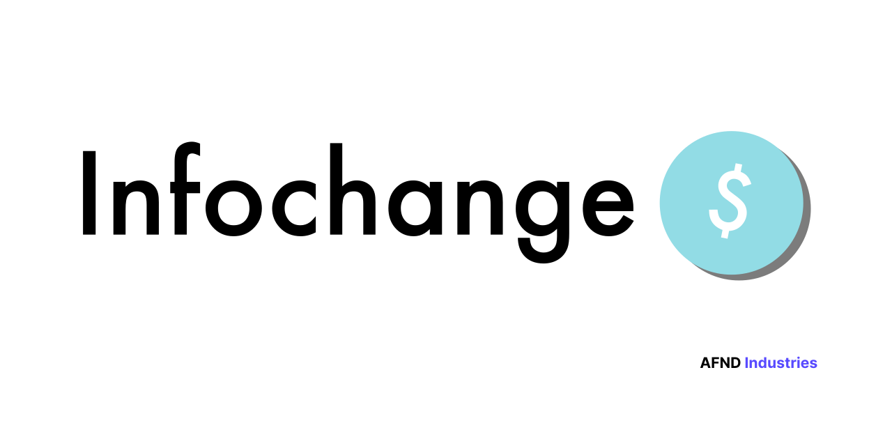

# InfoChange



Simulador de exchange de criptomonedas. Precios reales de Binance, dinero
ficticio: se puede operar, transferir saldo a otros usuarios e ingresar o retirar
fondos sin ningún riesgo ni ningún dato financiero real.

Nació como proyecto de la asignatura de **Tecnologías Avanzadas de la Web**
(Universidad de Málaga) y se ha reescrito para que funcione entero sobre
servicios gratuitos, sin servidor que mantener.

---

## Qué hace

- **Trading al contado** sobre pares reales de Binance, con comisión del 0,065 %.
- **Cartera multiactivo** valorada al precio de mercado.
- **Transferencias entre usuarios**, al estilo Bizum.
- **Ingresos y retiradas** simulados por tarjeta, IBAN o PayPal.
- **Historial** de operaciones, pagos y transferencias, exportable a PDF.
- **Panel de administración** con las métricas del exchange.
- **Contenedor Android** con Capacitor.

> Es un simulador. No se procesa ningún pago real y no se almacenan datos
> financieros: del medio de pago solo se guarda una referencia enmascarada.

## Cómo está construido

| Capa | Tecnología |
| --- | --- |
| Web | React 18, Vite 6, React Query, React Bootstrap |
| API | Hono sobre Vercel Functions (Node 22) |
| Base de datos | Postgres en Neon, con Drizzle ORM |
| Sesión | JWT firmado, en cookie `httpOnly` |
| Datos de mercado | API pública de Binance, cacheada en la CDN |
| Tests | Vitest sobre PGlite (Postgres en WebAssembly) |

Todo se despliega como **un solo proyecto de Vercel**: el frontend estático y la
API comparten origen, de modo que no hay CORS que configurar ni dominios que
coordinar.

```
InfoChange/
├── api/[...route].ts     punto de entrada de Vercel
├── server/               API: rutas, esquema, migraciones y tests
├── web/                  frontend y contenedor Android
├── scripts/              utilidades de datos
└── docs/                 documentación, diseño y prototipos
```

## Empezar

Requisito: Node 20 o superior.

```bash
npm install
npm run dev
```

Sin configurar nada, la API arranca sobre un Postgres en memoria (PGlite) con el
esquema ya aplicado. Es suficiente para desarrollar; los datos se pierden al
parar el servidor.

Para trabajar contra una base de datos de verdad —local, de Neon o de cualquier
otro proveedor— basta con definir `DATABASE_URL`:

```bash
cp .env.example .env      # rellenar DATABASE_URL y SESSION_SECRET
npm run db:migrate
npm run db:seed
npm run dev
```

- Web: <http://localhost:5173>
- API: <http://localhost:3003/api/health>

### Comandos

| Comando | Qué hace |
| --- | --- |
| `npm run dev` | Levanta API y web a la vez |
| `npm test` | Tests del backend (no necesita base de datos) |
| `npm run verify` | Tipos, estilo, tests y build |
| `npm run db:generate` | Genera una migración a partir del esquema |
| `npm run db:migrate` | Aplica las migraciones pendientes |

## Despliegue

Ver **[docs/despliegue.md](./docs/despliegue.md)**. En resumen: importar el
repositorio en Vercel, definir `DATABASE_URL` y `SESSION_SECRET`, y desplegar.

## De la v1 a la v2

Esta versión es una reescritura. La v1 era un frontend de React contra un Express
con SQLite que vivía en un VPS con pm2 y nginx, y cuyo despliegue automático
llevaba roto desde junio de 2024.

Lo más relevante que cambió:

| | v1 | v2 |
| --- | --- | --- |
| Contraseñas | SHA-256 sin sal | scrypt con sal y factor de coste |
| Administrador | llamarse «admin» | columna `role`, verificada en el servidor |
| Saldos | `REAL` sin transacciones | `numeric` con transacciones y `CHECK` |
| Datos de pago | tarjeta, CVV y contraseña de PayPal en claro | solo una referencia enmascarada |
| Bundle | ~3,7 MB (6,7 MB de JSON estáticos) | carga diferida por pantalla |
| Peticiones | 2-3 por segundo y usuario | al enfocar la pestaña y tras cada operación |
| Tests | ninguno | 52 |

El detalle completo, hallazgo por hallazgo, está en
**[docs/auditoria.md](./docs/auditoria.md)**. El estado de las dependencias —de
314 vulnerabilidades a ninguna que afecte a lo desplegado— en
**[docs/dependencias.md](./docs/dependencias.md)**.

## Autoría

Proyecto de **AFND Industries**: Antonio Cañete Baena, Eulogio Quemada, Alejandro
Román Sánchez y Antonio Blas Moral Sánchez.

## Licencia

[CC BY-NC-SA 4.0](https://creativecommons.org/licenses/by-nc-sa/4.0/) — ver
[Licence.md](./Licence.md).
